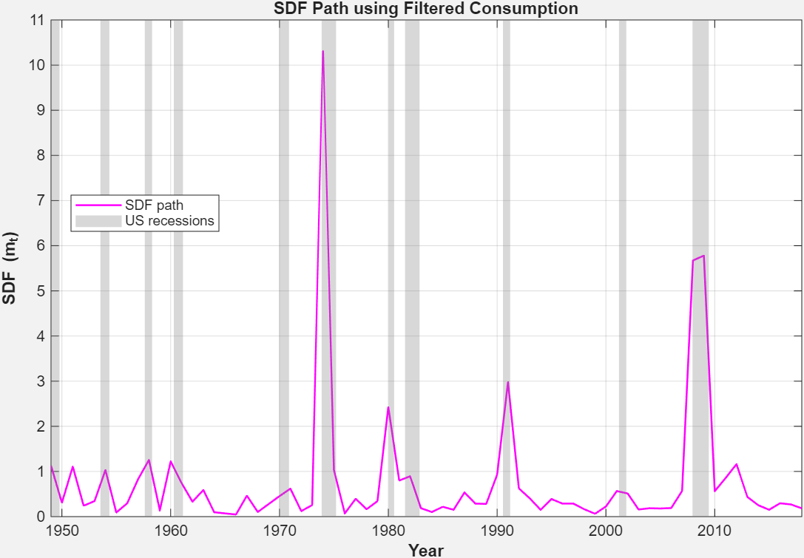

# Consumption-Based Asset Pricing with GMM in MATLAB

This project implements and tests the **Consumption-Based Asset Pricing Model (CBM)** using MATLAB.  
It applies the **Generalized Method of Moments (GMM)** to estimate parameters, evaluate puzzles such as the risk-free rate,  
and compare how different measures of consumption growth explain asset returns.  

---

## 📘 Overview
- Empirical test of the **Consumption-Based Asset Pricing Model (CCAPM)**
- MATLAB implementation for parameter estimation and simulation
- Uses **GMM** to estimate the coefficient of relative risk aversion
- Tests model predictions against observed asset returns

---

## 🛠️ Methods
- **Data:** Portfolio returns and consumption growth series  
- **Tools:** MATLAB `.m` scripts, figures, and report  
- **Approach:**  
  1. Set up moment conditions implied by Euler equations  
  2. Estimate parameters using GMM  
  3. Interpret model fit and economic significance  

---

## 📊 Key Results
- Estimated risk aversion parameters  
- Evidence on the **risk-free rate puzzle** and **equity premium puzzle**  
- Visual analysis of model fit and residuals

### Example Output


*(See more results in the `figures/` folder.)*


## 📂 Repository Structure

├── matlab/      # MATLAB scripts
├── figures/     # Output plots
├── report/      # Final project report (PDF)
└── README.md    # Documentation


---

## 🚀 How to Run
1. Clone this repository:
   ```bash
   git clone https://github.com/TejasviniBhatt/consumption-asset-pricing.git
   cd consumption-asset-pricing/matlab

2. Open MATLAB and run:
   main_script.m

##✍️ Author

Developed as part of coursework in MSc Economics & Finance, University of Tübingen.
By Tejasvini Bhatt


